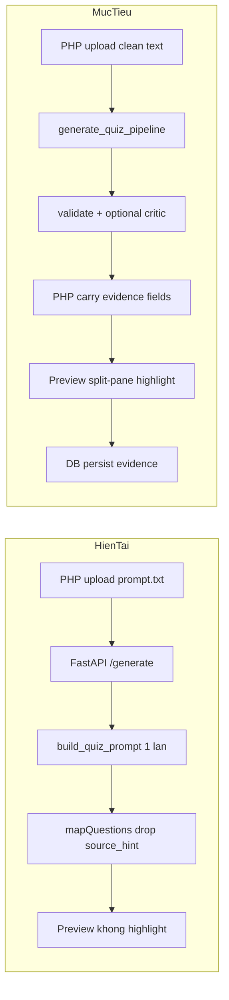
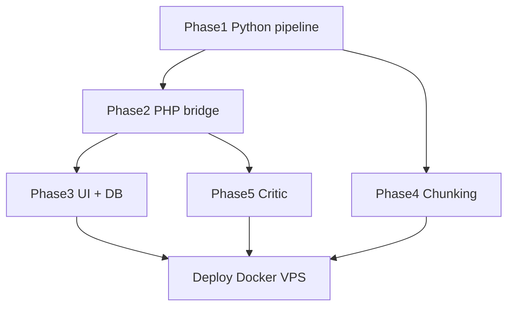

# Plan triển khai Chatbot Grounded Generation

## Bối cảnh hiện tại

Dự án đã có **skeleton** grounding trong Python nhưng **chưa chạy end-to-end**:

| Thành phần | Trạng thái |
|---|---|
| `source_hint` trong prompt | Có — [`CHATBOT-AI/app/core/prompt_templates.py`](CHATBOT-AI/app/core/prompt_templates.py) |
| `generate_quiz_pipeline` (3 layer) | Có — **không được gọi** từ [`CHATBOT-AI/app/api/main.py`](CHATBOT-AI/app/api/main.py) |
| `auto_review` flag | Có — **bị bỏ qua** (hardcode `false` ở PHP) |
| PHP map + normalize | **Drop** `source_hint`, `explanation`, `confidence` |
| Preview UI | Chỉ hiện câu hỏi; `document_content` có trong session nhưng **không render** |
| DB `questions` | Không có cột evidence/confidence |



---

## Phase 1 — Backend Python: bật pipeline grounded (2–3 ngày)

### 1.1 Chuẩn hóa schema câu hỏi

**File:** [`CHATBOT-AI/app/core/prompt_templates.py`](CHATBOT-AI/app/core/prompt_templates.py)

- Đổi/alias `source_hint` → `evidence_quote` (giữ backward compat: đọc cả hai key)
- Thêm trường bắt buộc trong prompt JSON:
  - `evidence_quote` — copy nguyên văn từ tài liệu (10–200 từ)
  - `reasoning` — giải thích ngắn tại sao đáp án đúng
  - `confidence_score` — integer 0–100
- Cập nhật `FEW_SHOT_EXAMPLES` và format JSON trong `build_quiz_prompt`

### 1.2 Validation cứng phía server

**File:** [`CHATBOT-AI/app/core/prompt_templates.py`](CHATBOT-AI/app/core/prompt_templates.py)

Thêm hàm `validate_evidence_quote(quote, source_text) -> bool`:
- Normalize whitespace, lowercase
- Fuzzy match: quote phải là **substring** hoặc ≥85% token overlap với source
- Trả về `grounding_status`: `verified` | `partial` | `missing`

Mở rộng `validate_single_question()` để check `evidence_quote` thay vì chỉ check từng từ rời rạc (rule 95% hiện tại quá cứng với paraphrase hợp lệ).

### 1.3 Wire `generate_quiz_pipeline` vào `/generate`

**File:** [`CHATBOT-AI/app/api/main.py`](CHATBOT-AI/app/api/main.py)

Thay body `_generate_single_sync()`:

```python
# Thay vì: generate_questions(SYSTEM_PROMPT, prompt)
# Dùng:
from app.core.prompt_templates import generate_quiz_pipeline
questions = generate_quiz_pipeline(
    llm_call_func=lambda p: generate_questions(SYSTEM_PROMPT, p),
    text_chunk=context,
    num_questions=num_q,
    difficulty=difficulty,
)
```

Logic `auto_review`:
- `auto_review=True` → luôn chạy Layer 2 (`build_review_prompt`)
- `auto_review=False` (mặc định) → chỉ chạy critic cho câu có `grounding_status != verified` hoặc `confidence_score < 70`

Cập nhật `QuestionItem` Pydantic model:

```python
evidence_quote: str = ""
reasoning: str = ""
confidence_score: int = 0
grounding_status: str = "unknown"
```

Post-process mỗi câu sau generate: gọi validation, gắn `grounding_status`, sort theo `confidence_score` ASC (câu mơ hồ lên đầu).

### 1.4 Sửa luồng upload PHP → Python

**Vấn đề:** [`ChatbotAIServiceProvider.php`](app/Services/AI/ChatbotAIServiceProvider.php) upload **cả prompt wrapper** (QUESTION_COUNT, OUTPUT_SCHEMA...) thành `.txt`, làm chunking và grounding lệch nguồn.

**Giải pháp:**
- Thêm method `uploadRawContent(string $content, string $filename): array` — upload text sạch
- Trong `generate()`: tách `document_content` từ prompt (hoặc nhận JSON structured thay vì plain prompt)
- [`QuizGenerationService.php`](app/Services/QuizGenerationService.php): khi provider là `ChatbotAIServiceProvider`, gọi path mới truyền raw content + metadata

Payload `/generate` đầy đủ:

```json
{
  "session_id": "...",
  "num_questions": 20,
  "difficulty": "medium",
  "language": "vi",
  "topic_hint": "",
  "auto_review": false
}
```

Parse `language` từ prompt builder (DocumentController đã thu thập `vi`/`en` tại line 87–90).

### 1.5 Tests Python

**File:** [`CHATBOT-AI/tests/test_pipeline.py`](CHATBOT-AI/tests/test_pipeline.py)

Thêm test cases:
- `test_evidence_quote_substring_validation`
- `test_pipeline_returns_grounding_fields`
- `test_auto_review_filters_bad_questions`
- `test_confidence_sort_order`

---

## Phase 2 — PHP bridge: carry fields end-to-end (1–2 ngày)

### 2.1 Map fields từ Python

**File:** [`app/Services/AI/ChatbotAIServiceProvider.php`](app/Services/AI/ChatbotAIServiceProvider.php) — `mapQuestions()`

Thêm mapping:

```php
'evidence_quote'    => $q['evidence_quote'] ?? $q['source_hint'] ?? '',
'reasoning'         => $q['reasoning'] ?? '',
'explanation'       => $q['explanation'] ?? '',
'confidence_score'  => (int)($q['confidence_score'] ?? 0),
'grounding_status'  => $q['grounding_status'] ?? 'unknown',
'bloom_level'       => $q['bloom_level'] ?? '',
```

Bật `auto_review` qua env `CHATBOT_AI_AUTO_REVIEW=true` hoặc parse từ prompt.

### 2.2 Preserve trong normalize

**File:** [`app/Services/QuizGenerationService.php`](app/Services/QuizGenerationService.php) — `normalizeQuestions()`

Giữ optional fields (không bắt buộc validation — câu thiếu evidence vẫn qua preview để user sửa):

```php
$result[] = [
    'question_content' => $content,
    'answers' => $normalizedAnswers,
    'correct_answer' => $correct,
    'source' => 'ai',
    'evidence_quote' => trim((string)($item['evidence_quote'] ?? '')),
    'explanation' => trim((string)($item['explanation'] ?? '')),
    'confidence_score' => max(0, min(100, (int)($item['confidence_score'] ?? 0))),
    'grounding_status' => (string)($item['grounding_status'] ?? 'unknown'),
];
```

Sort kết quả: `confidence_score` ASC, rồi `grounding_status != verified` trước.

**File:** [`app/Controllers/QuizController.php`](app/Controllers/QuizController.php) — `normalizePreviewQuestions()`

Cho phép pass-through các trường trên qua session draft và form submit (`questions_payload` JSON).

### 2.3 Cập nhật JS payload

**File:** [`public/assets/js/app.js`](public/assets/js/app.js) — `setupPreviewQuestionPayload()`

Mở rộng serialize/deserialize:

```javascript
{ question_content, answers, correct_answer, source,
  evidence_quote, explanation, confidence_score, grounding_status }
```

Render badge trên card: confidence thấp (đỏ), grounding `missing` (vàng).

---

## Phase 3 — UI Human-in-the-Loop + DB (2–3 ngày)

### 3.1 Preview split-pane với highlight

**File:** [`app/Views/quizzes/preview.php`](app/Views/quizzes/preview.php)

Layout 2 cột (responsive: stack trên mobile):

```
+---------------------------+---------------------------+
| Danh sach cau hoi         | Tai lieu goc              |
| [card 1] confidence: 40   | (document_content)        |
| [card 2] confidence: 95   | >>> highlight evidence <<<|
+---------------------------+---------------------------+
```

**File:** [`public/assets/js/app.js`](public/assets/js/app.js) + [`public/assets/css/app.css`](public/assets/css/app.css)

- Click câu hỏi → panel phải scroll tới và highlight `evidence_quote` trong `document_content`
- Highlight algorithm: exact match → normalize whitespace → fuzzy (first 60 chars)
- Nếu không tìm thấy quote → hiện banner "Khong tim thay bang chung trong tai lieu"
- Pin câu `confidence_score < 70` hoặc `grounding_status != verified` lên đầu danh sách (server sort + client re-sort khi edit)

Data source: `$draft['document_content']` đã có sẵn trong session — **không cần API mới**.

### 3.2 DB migration

**File mới:** `database/migrations/003_add_questions_grounding.sql`

```sql
ALTER TABLE questions
  ADD COLUMN evidence_quote LONGTEXT NULL AFTER correct_answer,
  ADD COLUMN explanation LONGTEXT NULL AFTER evidence_quote,
  ADD COLUMN confidence_score TINYINT UNSIGNED NULL AFTER explanation,
  ADD COLUMN grounding_status VARCHAR(20) NULL DEFAULT 'unknown' AFTER confidence_score;
```

Cập nhật [`database/schema.sql`](database/schema.sql), [`MysqlPlatformRepository.php`](app/Repositories/MysqlPlatformRepository.php), [`SqlitePlatformRepository.php`](app/Repositories/SqlitePlatformRepository.php) — `createQuiz()` INSERT thêm 4 cột.

### 3.3 Hiển thị sau khi lưu (optional nhẹ)

**File:** view chi tiết quiz / edit question — hiện `evidence_quote` dạng blockquote nhỏ dưới câu hỏi AI (read-only, không bắt buộc split-pane).

---

## Phase 4 — Chunking nâng cao + phân loại tài liệu (2–3 ngày)

### 4.1 Per-chunk generation

**File:** [`CHATBOT-AI/app/api/main.py`](CHATBOT-AI/app/api/main.py)

Thay concat-all-chunks bằng strategy:

1. Chọn N chunk đại diện (round-robin hoặc theo `chunk_index`)
2. Mỗi chunk → `generate_quiz_pipeline(num_questions = ceil(total/N))`
3. Gắn `chunk_index` vào metadata câu hỏi
4. Dedup + sort confidence

Env flag `GENERATION_MODE=concat|per_chunk` để rollback dễ.

### 4.2 Page metadata

**File:** [`CHATBOT-AI/app/core/document_processor.py`](CHATBOT-AI/app/core/document_processor.py)

- PDF: populate `chunk.page` từ page boundary khi extract
- DOCX: detect heading styles → `chapter`

Dùng cho UI: "Nguon: Trang X" bên cạnh evidence.

### 4.3 Phân loại tài liệu (document type)

**File mới:** `CHATBOT-AI/app/core/document_classifier.py`

Heuristic nhanh (không cần LLM):
- `technical` — nhiều code block, công thức `$...$`, `\frac`
- `legal` — pattern "Điều N", "Khoản", "Luật số"
- `textbook` — default

**File:** [`CHATBOT-AI/app/core/prompt_templates.py`](CHATBOT-AI/app/core/prompt_templates.py)

Prompt variant theo type:
- `technical`: yêu cầu giữ nguyên code/formula trong evidence_quote
- `legal`: evidence phải chứa số điều/khoản
- `textbook`: rule hiện tại

Trả `document_type` trong `/upload` response; PHP lưu vào draft metadata.

---

## Phase 5 — Dual-LLM Critic có điều kiện (1 ngày)

Không bật critic cho mọi câu (tốn 2x API). Chỉ khi:

```
grounding_status != 'verified'
OR confidence_score < 70
OR evidence_quote == ''
```

**File:** [`CHATBOT-AI/app/core/prompt_templates.py`](CHATBOT-AI/app/core/prompt_templates.py)

Prompt critic trả về:

```json
{ "valid": true/false, "reason": "...", "suggested_fix": "..." }
```

Câu `valid=false` → flag `critic_rejected=true`, đẩy lên đầu preview với badge đỏ.

Env: `CRITIC_MODEL` (model rẻ hơn generator) trong [`CHATBOT-AI/.env.example`](CHATBOT-AI/.env.example).

---

## Thứ tự triển khai và phụ thuộc



| Phase | Effort | Phụ thuộc |
|---|---|---|
| 1 Backend Python | 2–3 ngày | — |
| 2 PHP bridge | 1–2 ngày | Phase 1 |
| 3 UI + DB | 2–3 ngày | Phase 2 |
| 4 Chunking | 2–3 ngày | Phase 1 (song song Phase 2–3 được) |
| 5 Critic | 1 ngày | Phase 1 |

**Tổng ước tính:** 8–12 ngày làm việc.

---

## Checklist verify trước khi deploy

1. Upload PDF 10 trang → generate 20 câu → mỗi câu có `evidence_quote` non-empty
2. Preview: click câu → highlight đúng đoạn trong tài liệu (≥80% case)
3. Câu confidence < 70 hiện badge và nằm đầu danh sách
4. Save quiz → DB có `evidence_quote`, `confidence_score`
5. `auto_review=true` loại được câu hallucination rõ ràng (test với sample ML content trong [`test_pipeline.py`](CHATBOT-AI/tests/test_pipeline.py))
6. Regression: flow paste text (`POST /quizzes`) và upload+AI (`POST /documents`) vẫn hoạt động
7. Docker: rebuild image CHATBOT-AI, restart container, smoke test `/health` + end-to-end từ PHP

---

## Rủi ro và giảm thiểu

| Rủi ro | Giảm thiểu |
|---|---|
| LLM không tuân format JSON mới | Fallback parse `source_hint`; validation reject + retry 1 lần |
| Evidence quote paraphrase → không highlight được | Fuzzy match 85%; hiện warning thay vì fail |
| Chi phí API tăng (critic) | Chỉ critic câu flagged (~20–30% batch) |
| Breaking change PHP↔Python | Alias `source_hint` ↔ `evidence_quote` trong 1 sprint |
| Upload prompt.txt cũ | Feature flag `CHATBOT_AI_CLEAN_UPLOAD=true` rollout từng bước |

---

## Files chính cần sửa (tóm tắt)

**Python:** `prompt_templates.py`, `main.py`, `document_processor.py`, `document_classifier.py` (mới), `test_pipeline.py`

**PHP:** `ChatbotAIServiceProvider.php`, `QuizGenerationService.php`, `QuizController.php`, `MysqlPlatformRepository.php`, `SqlitePlatformRepository.php`

**Frontend:** `preview.php`, `app.js`, `app.css`

**DB:** `003_add_questions_grounding.sql`, `schema.sql`
