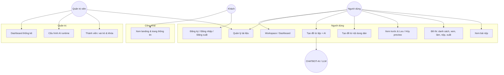
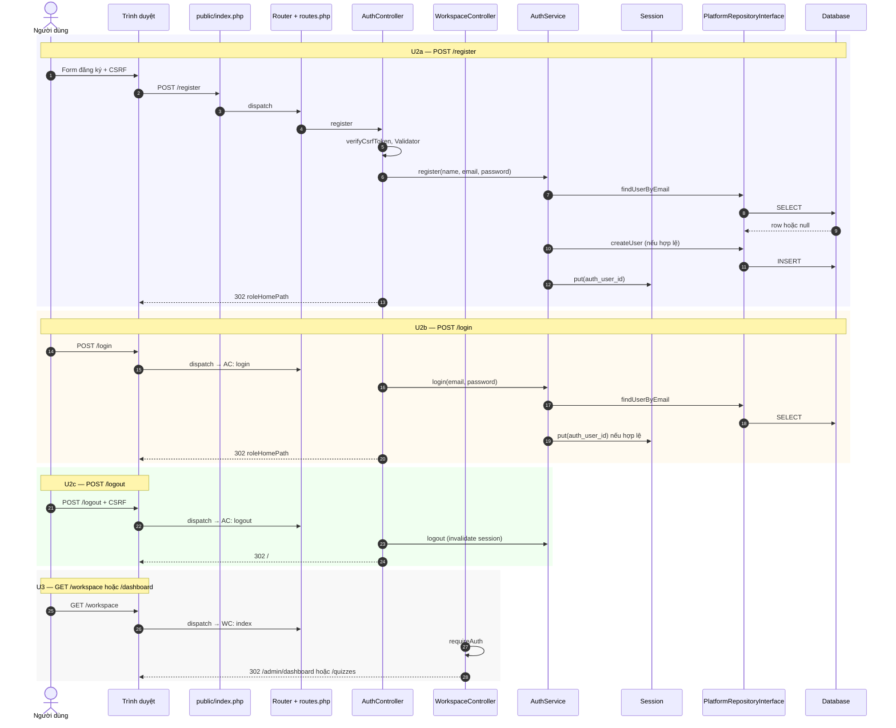
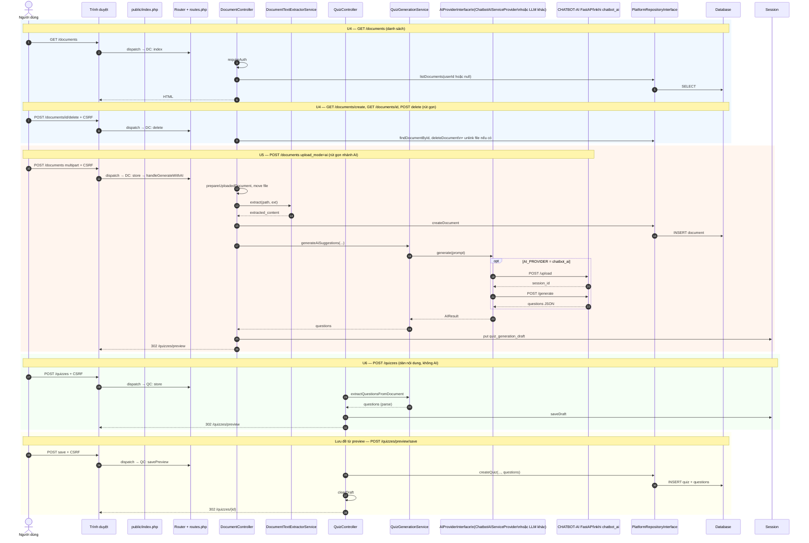
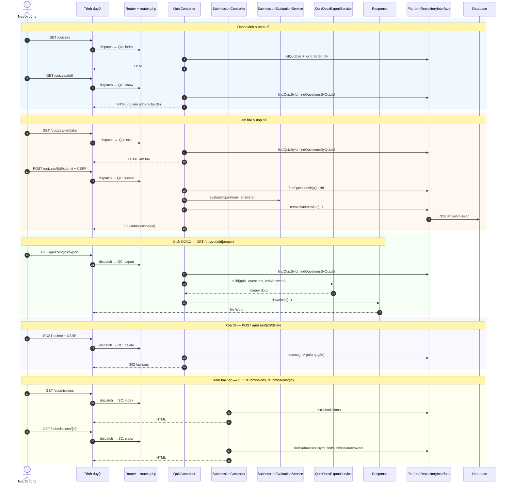
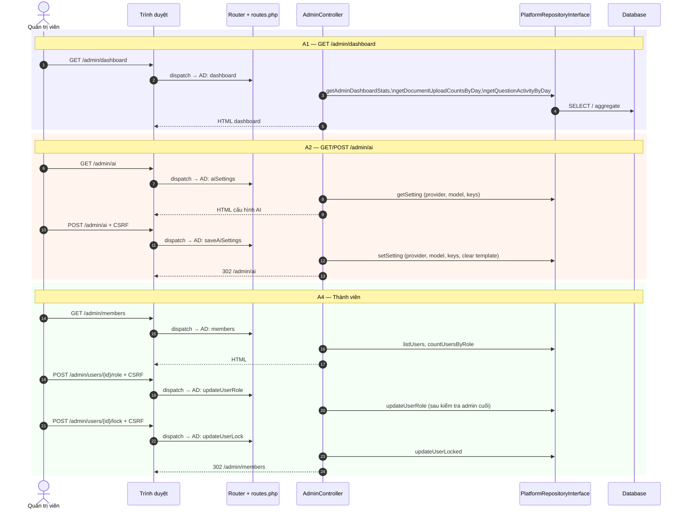
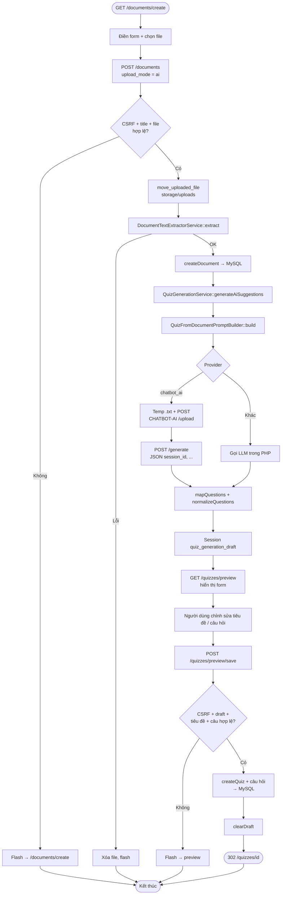

# Đặc tả cuối cùng V2 — LivQuiz / PRX

Tài liệu này phản ánh **phạm vi chức năng đã lược bỏ** so với phiên bản đặc tả rộng hơn: **không** mô tả **Gợi ý AI trên preview (U7)**, **Ngân hàng câu hỏi (U9)**, và **Duyệt câu hỏi / Báo cáo** (`/admin/questions`, `/admin/reports`, …). Các route tương ứng **có thể vẫn còn trong** `routes.php` và controller — chúng được liệt kê ở mục *Phạm vi loại trừ* để tránh nhầm lẫn, nhưng **không** có trong biểu đồ và bảng đặc tả chi tiết bên dưới.

**Điểm vào ứng dụng:** `public/index.php` → `bootstrap.php` (container) → `Router::dispatch` với các tuyến khai báo trong `routes.php` (đối chiếu trực tiếp tại thời điểm rà soát).

---

## 1. Phạm vi và loại trừ

### 1.1. Thuộc phạm vi V2 (có Use Case, đặc tả, sequence)

| Nhóm | Nội dung | Route chính (tham chiếu `routes.php`) |
| --- | --- | --- |
| Công khai | Trang landing, chính sách, trợ giúp, liên hệ | `GET /`, `/privacy-policy`, `/terms-of-use`, `/help-center`, `/contact` |
| U2 | Đăng ký, đăng nhập, đăng xuất | `GET/POST /login`, `GET/POST /register`, `POST /logout` |
| U3 | Workspace / Dashboard (redirect theo vai trò) | `GET /workspace`, `GET /dashboard` |
| U4 | Quản lý tài liệu (người dùng) | `GET /documents`, `/documents/create`, `POST /documents`, `GET /documents/{id}`, `POST /documents/{id}/delete` |
| U5 | Tạo đề từ tệp + AI | `POST /documents` (`upload_mode=ai`) → preview → lưu |
| U6 | Tạo đề từ nội dung dán (parse, không AI) | `GET /quizzes/create`, `POST /quizzes` → preview → lưu |
| Luồng preview / lưu | Xem trước, lưu đề, hủy preview (**không** gợi ý AI) | `GET /quizzes/preview`, `POST /quizzes/preview/save`, `POST /quizzes/preview/discard` |
| U8 | Đề thi: danh sách, xem, làm bài, nộp, xóa, xuất; bài nộp | `GET/POST` các route `/quizzes*`, `/submissions*`, `GET /quizzes/{id}/export` |
| A1 | Dashboard quản trị | `GET /admin`, `GET /admin/dashboard` |
| A2 | Cấu hình AI runtime (form admin) | `GET /admin/ai`, `POST /admin/ai` |
| A4 | Thành viên: danh sách, đổi vai trò, khóa | `GET /admin/members`, `GET /admin/users`, `POST /admin/users/{id}/role`, `POST /admin/users/{id}/lock` |

### 1.2. Ngoài phạm vi V2 (đã lược bỏ khỏi tài liệu & biểu đồ)

| Mục | Route / Controller (vẫn có thể tồn tại trong mã) |
| --- | --- |
| Gợi ý AI (U7) | `POST /quizzes/preview/suggest-ai` → `QuizController::suggestAiPreview` |
| Ngân hàng câu hỏi (U9) | `GET/POST /questions*`, `QuestionController` (trừ khi sau này gỡ route) |
| Duyệt câu hỏi & Báo cáo (phần A3) | `GET /admin/questions`, `GET /admin/reports`, `POST /admin/reports/{id}/status` |

**Ghi chú:** `GET /admin/documents`, `POST /admin/documents/{id}/delete` vẫn map trong `routes.php` nhưng **không** nằm trong danh sách Use Case tổng quát do người dùng yêu cầu; có thể bổ sung ở phiên bản đặc tả sau nếu cần.

---

## 2. Biểu đồ Use Case tổng quát (phạm vi V2)

---

## 3. Bảng đặc tả Use Case chi tiết (đối chiếu `routes.php`)

Cột **Route** ghi đúng method và path đang đăng ký trong `routes.php` (rà soát theo mã nguồn hiện tại).

| ID | Tên | Route | Controller::method | Tác nhân | Tiền điều kiện | Luồng chính | Ngoại lệ |
| --- | --- | --- | --- | --- | --- | --- | --- |
| **P1** | Trang công khai | `GET /`, `/privacy-policy`, `/terms-of-use`, `/help-center`, `/contact` | `LandingController::index`, `privacyPolicy`, `termsOfUse`, `helpCenter`, `contact` | Khách | Không | Router dispatch → render view landing / `info_page`. `GET /` nếu đã đăng nhập thì redirect `roleHomePath`. | — |
| **U2** | Đăng ký / Đăng nhập / Đăng xuất | `GET/POST /login`, `GET/POST /register`, `POST /logout` | `AuthController` | Khách / Người dùng | Form có CSRF (POST); đăng ký: mật khẩu ≥ 6 ký tự | Validator → `AuthService::register` / `login` → `PlatformRepository` → ghi session `auth_user_id` → redirect. Logout: xóa session. | CSRF; sai thông tin; email trùng; tài khoản khóa |
| **U3** | Workspace / Dashboard | `GET /workspace`, `GET /dashboard` | `WorkspaceController::index` | Người dùng / Admin | Đã đăng nhập | `requireAuth` → redirect: admin → `/admin/dashboard`, user → `/quizzes`. | Chưa đăng nhập → `/login` |
| **U4** | Quản lý tài liệu | `GET /documents`, `/documents/create`, `POST /documents`, `GET /documents/{id}`, `POST /documents/{id}/delete` | `DocumentController` | Người dùng; Admin xem toàn bộ | Đã đăng nhập; POST có CSRF | `index` / `create` / `show` / `delete`: `listDocuments` / `findDocumentById` / `deleteDocument` + quyền sở hữu; `store` với `upload_mode=ai` thuộc **U5** (xem bảng U5). | Không quyền; không tìm thấy; CSRF |
| **U5** | Tạo đề từ tệp + AI | `POST /documents` (`upload_mode=ai`); sau đó `GET /quizzes/preview`, `POST /quizzes/preview/save` | `DocumentController::store` → `handleGenerateWithAI`; `QuizController::preview`, `savePreview` | Người dùng; AI | Đã đăng nhập; cấu hình AI hợp lệ | Trích xuất văn bản → `createDocument` → `QuizGenerationService::generateAiSuggestions` → `AIProviderInterface` (vd. `ChatbotAIServiceProvider` → FastAPI `/upload`, `/generate`) → session draft → preview → lưu `createQuiz`. | File lỗi; trích xuất lỗi; AI lỗi; CSRF; validation preview |
| **U6** | Tạo đề từ nội dung dán | `GET /quizzes/create`, `POST /quizzes`; sau đó preview / save | `QuizController::create`, `store`, `preview`, `savePreview` | Người dùng | Đã đăng nhập | `store`: `extractQuestionsFromDocument` (parse, **không** gọi AI) → draft session → preview → `savePreview` → `createQuiz`. | Parse thất bại; CSRF; validation |
| **PV** | Xem trước & Lưu / Hủy | `GET /quizzes/preview`, `POST /quizzes/preview/save`, `POST /quizzes/preview/discard` | `QuizController::preview`, `savePreview`, `discardPreview` | Người dùng | Có draft session (trừ discard có thể xử lý CSRF) | `preview` render; `savePreview` merge câu (và gợi ý đã tick nếu có trong draft từ phiên bản cũ — trong V2 không tạo gợi ý mới); `discardPreview` xóa draft. | Không draft; không câu hợp lệ khi lưu |
| **U8** | Đề thi & làm bài & xuất | `GET /quizzes`, `/quizzes/create`, `/quizzes/{id}`, `/quizzes/{id}/take`, `POST /quizzes/{id}/submit`, `POST /quizzes/{id}/delete`, `GET /quizzes/{id}/export` | `QuizController` | Người dùng; Admin | Đã đăng nhập | Danh sách theo `created_by`; `show` chỉ admin/chủ đề; `take`/`submit` qua `SubmissionEvaluationService`; `export` DOCX; `delete` có quyền. | Quiz không tồn tại; quyền; lỗi xuất file |
| **US** | Xem bài nộp | `GET /submissions`, `GET /submissions/{id}` | `SubmissionController::index`, `show` | Người dùng; Admin | Đã đăng nhập | `listSubmissions` (lọc user hoặc toàn bộ admin); `show` + `findSubmissionAnswers` với kiểm tra quyền. | Không tìm thấy; không quyền |
| **A1** | Dashboard Admin | `GET /admin`, `GET /admin/dashboard` | `AdminController::index`, `dashboard` | Admin | Role admin | `index` redirect dashboard; thống kê + chuỗi ngày biểu đồ. | `requireAuth` từ chối |
| **A2** | Cấu hình AI | `GET /admin/ai`, `POST /admin/ai` | `AdminController::aiSettings`, `saveAiSettings` | Admin | Role admin | Đọc/ghi settings DB + env; lưu provider OpenAI/Gemini/DeepSeek, model, key. | CSRF; model rỗng |
| **A4** | Thành viên | `GET /admin/members`, `GET /admin/users`, `POST /admin/users/{id}/role`, `POST /admin/users/{id}/lock` | `AdminController::members`, `users`, `updateUserRole`, `updateUserLock` | Admin | Role admin | Danh sách user; đổi role (không hạ admin cuối); khóa/mở (không khóa chính mình / admin). | CSRF; rule nghiệp vụ |

---

## 4. Biểu đồ trình tự (Sequence Diagram) — theo nhóm

### Nhóm 1 — Xác thực & Workspace (U2, U3)

### Nhóm 2 — Quản lý tài liệu & Tạo đề AI / Thủ công (U4, U5, U6)

### Nhóm 3 — Thực hiện bài thi & Xuất đề (U8)

### Nhóm 4 — Quản trị (A1, A2, A4)

---

## 5. Biểu đồ hoạt động — Upload tài liệu → AI → Preview → Lưu đề

Luồng **U5** kết hợp **`POST /documents`** (AI) và **`POST /quizzes/preview/save`**. Nhánh **CHATBOT-AI** minh họa khi `AI_PROVIDER=chatbot_ai`; provider khác thay bằng gọi API LLM trực tiếp trong PHP.

---

## 6. Tóm tắt route `routes.php` thuộc phạm vi V2

Các dòng sau **có trong** `routes.php` và **được đặc tả** trong V2:

- `LandingController`: `/`, `/privacy-policy`, `/terms-of-use`, `/help-center`, `/contact`
- `AuthController`: `/login`, `/register`, `/logout` (GET/POST theo routes)
- `WorkspaceController`: `/workspace`, `/dashboard`
- `DocumentController`: `/documents` (GET create, POST, GET `{id}`, POST delete)
- `QuizController`: `/quizzes`, `/quizzes/create`, POST `/quizzes`, `/quizzes/preview`, POST `preview/save`, POST `preview/discard`, `/quizzes/{id}`, `take`, POST `submit`, POST `delete`, GET `export`
- `SubmissionController`: `/submissions`, `/submissions/{id}`
- `AdminController`: `/admin`, `/admin/dashboard`, `/admin/ai`, `/admin/members`, `/admin/users`, POST `users/{id}/role`, POST `users/{id}/lock`
- `LeaderboardController`: `/leaderboard` (redirect — có thể ghi chú ngắn trong triển khai)

**Không đưa vào đặc tả V2 (theo yêu cầu lược bỏ):** `POST /quizzes/preview/suggest-ai`; toàn bộ `/questions*`; `/admin/questions`, `/admin/reports`, `POST /admin/reports/{id}/status`.

---

*Tài liệu V2 — đối chiếu mã nguồn `routes.php` và controller map tại thời điểm tạo. Khi gỡ route hoặc đổi tên action, cần cập nhật lại tài liệu này.*
