# Kiến trúc hệ thống — LivQuiz / PRX

Tài liệu này tóm tắt kiến trúc ứng dụng PHP theo mã nguồn thực tế: điểm vào `public/index.php`, đăng ký tuyến trong `routes.php`, xử lý tại các lớp `App\Controllers\*`, dịch vụ nghiệp vụ trong `app/Services`, lưu trữ qua `App\Repositories\MysqlPlatformRepository` và `App\Core\Database`. Tích hợp AI có thể dùng nhà cung cấp trực tiếp (OpenAI, Gemini, DeepSeek) hoặc proxy tới microservice **CHATBOT-AI** (`App\Services\AI\ChatbotAIServiceProvider`) khi `AI_PROVIDER=chatbot_ai` trong cấu hình môi trường (xem `bootstrap.php`).

> **Lưu ý về giao diện “câu hỏi”:** Trong code hiện tại, người dùng không nhập một câu chat ngắn vào một ô hội thoại riêng. Luồng chính tới CHATBOT-AI là **tải tài liệu (PDF/DOCX/TXT)** hoặc **nội dung nguồn dài** được trích xuất/ghép prompt; sau đó PHP gọi pipeline FastAPI (`/upload` rồi `/generate`). Biểu đồ hoạt động và trình tự bên dưới mô tả đúng luồng này.

---

## 1. Biểu đồ Use Case (tổng hợp)

Các tác nhân và nhóm chức năng được suy ra từ `routes.php` và các controller tương ứng.

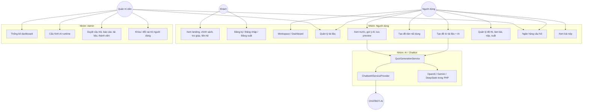

**Tham chiếu route (rút gọn):** `/`, `/login`, `/register`, `/workspace`, `/documents*`, `/quizzes*`, `/questions*`, `/submissions*`, `/admin*`, `/users` — chi tiết trong `routes.php`.

---

## 2. Đặc tả Use Case (3 use case then chốt + chi tiết ở mục 2.1)

Mục **2.1** là đặc tả chi tiết cho **upload / danh sách / chi tiết / xóa tài liệu** và **xem trước–chỉnh sửa đề**; các mục **UC-01–UC-03** bên dưới tóm tắt luồng lớn (AI, CRUD tổng quát, đăng nhập).

### UC-01 — Gửi yêu cầu AI (tạo đề trắc nghiệm từ tài liệu)

| Mục | Mô tả |
| --- | --- |
| **Tên** | Tạo đề bằng AI từ tài liệu đã tải lên |
| **Tác nhân** | Người dùng đã đăng nhập; hệ thống AI (OpenAI/Gemini/DeepSeek hoặc **CHATBOT-AI** qua `ChatbotAIServiceProvider`) |
| **Tiền điều kiện** | Đã đăng nhập; cấu hình `AI_PROVIDER` và khóa/tầng dịch vụ hợp lệ (với `chatbot_ai`: `AI_SERVICE_URL` và service Python chạy); form có CSRF token hợp lệ |
| **Luồng chính** | 1) Người dùng mở `GET /documents/create`. 2) Nhập tiêu đề, chọn số câu, độ khó, ngôn ngữ, chọn file PDF/DOCX/TXT. 3) Gửi `POST /documents` với `upload_mode=ai`. 4) `DocumentController::store` xác thực CSRF và gọi `handleGenerateWithAI`. 5) Trích xuất văn bản, lưu bản ghi tài liệu qua `PlatformRepositoryInterface::createDocument`. 6) `QuizGenerationService::generateAiSuggestions` build prompt và gọi `AIProviderInterface::generate`. 7) Nếu provider là CHATBOT-AI: upload nội dung prompt dạng file tạm → `POST .../upload` nhận `session_id` → `POST .../generate` nhận JSON câu hỏi. 8) Ghép draft vào session (`quiz_generation_draft`), flash thành công, chuyển hướng `GET /quizzes/preview`. |
| **Luồng thay thế** | **A1 — CSRF lỗi:** flash lỗi, quay lại `/documents/create`. **A2 — File thiếu/sai định dạng/quá dung lượng:** flash lỗi, quay lại form. **A3 — Trích xuất văn bản thất bại:** xóa file tạm nếu có, flash lỗi. **A4 — AI lỗi mạng/HTTP/JSON:** ghi log, flash lỗi, quay lại `/documents/create`. **A5 — Provider không phải CHATBOT-AI:** bước 7 thay bằng gọi API trực tiếp (OpenAI/Gemini/DeepSeek) trong provider tương ứng. |

### UC-02 — Quản lý dữ liệu (ví dụ: đề thi & tài liệu)

| Mục | Mô tả |
| --- | --- |
| **Tên** | Quản lý đề thi và tài liệu (CRUD, quyền sở hữu) |
| **Tác nhân** | Người dùng; Quản trị viên (quyền mở rộng trên tài liệu/câu hỏi toàn hệ thống) |
| **Tiền điều kiện** | Đã đăng nhập; thao tác thay đổi dữ liệu qua `POST` có CSRF hợp lệ khi áp dụng |
| **Luồng chính** | 1) Người dùng xem danh sách `GET /quizzes` hoặc `GET /documents` (lọc theo `created_by` / `user_id` nếu không phải admin). 2) Tạo mới hoặc chỉnh sửa theo route tương ứng (`QuizController`, `DocumentController`, `QuestionController`). 3) Admin truy cập `GET /admin/documents`, `GET /admin/questions`, v.v. để duyệt toàn bộ. 4) Controller gọi `PlatformRepositoryInterface` để đọc/ghi MySQL qua `Database`. |
| **Luồng thay thế** | **A1 — Truy cập tài liệu người khác (non-admin):** từ chối, flash lỗi, redirect. **A2 — Xóa tài liệu:** xóa file vật lý trong `storage/uploads` nếu tồn tại, rồi `deleteDocument`. **A3 — Báo cáo câu hỏi:** `POST /questions/{id}/report` lưu phản hồi cho admin xử lý. |

### UC-03 — Đăng nhập

| Mục | Mô tả |
| --- | --- |
| **Tên** | Đăng nhập vào hệ thống |
| **Tác nhân** | Người dùng (chưa có phiên hợp lệ) |
| **Tiền điều kiện** | Tài khoản tồn tại trong CSDL; tài khoản không bị khóa (theo logic `AuthService` / repository) |
| **Luồng chính** | 1) `GET /login` hiển thị form (`AuthController::showLogin`). 2) Người dùng gửi `POST /login` kèm email, mật khẩu, CSRF. 3) `AuthController::login` kiểm tra validator. 4) `AuthService::login` xác thực với repository, ghi session. 5) Flash thành công, chuyển hướng theo vai trò (`roleHomePath`). |
| **Luồng thay thế** | **A1 — CSRF không hợp lệ:** flash lỗi, quay lại `/login`. **A2 — Thiếu trường bắt buộc:** validator fails, flash lỗi. **A3 — Sai thông tin đăng nhập:** `AuthService` trả `success=false`, flash message, quay lại `/login`. |

### 2.1. Đặc tả Use Case chi tiết — Tài liệu và xem trước/chỉnh sửa đề

Các bảng dưới đây bám `DocumentController`, `QuizController` và `routes.php`. **Lưu ý:** luồng upload tài liệu trong code hiện tại **chỉ** nhận `upload_mode=ai` — tức vừa lưu tài liệu vừa chạy pipeline tạo đề AI rồi chuyển sang `/quizzes/preview`; không có use case riêng “chỉ upload không tạo đề”.

#### UC-TAILIEU-01 — Upload tài liệu (kèm tạo đề bằng AI)

| Mục | Mô tả |
| --- | --- |
| **Tên** | Upload tài liệu và khởi tạo bản nháp đề từ AI |
| **Tác nhân** | Người dùng đã đăng nhập; dịch vụ AI (`QuizGenerationService` → `AIProviderInterface` / CHATBOT-AI) |
| **Tiền điều kiện** | Phiên hợp lệ; `POST /documents` có CSRF đúng; `upload_mode` phải là `ai` (chữ thường sau trim); cấu hình AI và khóa dịch vụ hợp lệ theo `bootstrap` |
| **Luồng chính** | 1) Người dùng mở `GET /documents/create`. 2) Nhập **tiêu đề** tài liệu kiến thức; chọn **số câu** (1–50, mặc định 10), **độ khó** (`easy` / `medium` / `hard`), **ngôn ngữ** (`vi` / `en`); chọn **một file** `document_file` (PDF, DOCX hoặc TXT). 3) Gửi `POST /documents` với `upload_mode=ai`. 4) `DocumentController::store` xác thực CSRF và mode. 5) `prepareUploadedDocument`: kiểm tra file đã chọn, mã lỗi upload, phần mở rộng, kích thước ≤ **15 MB**, `move_uploaded_file` vào `storage/uploads/` với tên ngẫu nhiên. 6) `DocumentTextExtractorService::extract` lấy nội dung văn bản. 7) `PlatformRepositoryInterface::createDocument` ghi CSDL (user, tiêu đề, tên gốc, đường dẫn lưu, MIME, nội dung trích xuất). 8) `QuizGenerationService::generateAiSuggestions` (nội dung có thể được bọc chỉ dẫn ngôn ngữ). 9) Lưu object draft vào session `quiz_generation_draft` (gồm `document_id`, `questions`, metadata nguồn `generation_source` = `ai`, v.v.). 10) Flash thành công, redirect `GET /quizzes/preview`. |
| **Luồng thay thế** | **A1 — CSRF sai:** flash, về `/documents/create`. **A2 — `upload_mode` ≠ `ai`:** flash “Chế độ không hợp lệ”, về form. **A3 — Thiếu tiêu đề:** flash, về form. **A4 — Không file / upload lỗi / sai định dạng / kích thước:** flash tương ứng, về form. **A5 — Không tạo thư mục hoặc không `move_uploaded_file`:** flash, về form. **A6 — Trích xuất văn bản lỗi:** xóa file vừa lưu nếu có, flash lỗi kèm message, về form. **A7 — AI / mạng / JSON lỗi:** log, flash lỗi, về `/documents/create` (bản ghi tài liệu có thể đã tạo trước bước AI — hành vi hiện tại của controller). |

#### UC-TAILIEU-02 — Xem danh sách tài liệu

| Mục | Mô tả |
| --- | --- |
| **Tên** | Xem danh sách tài liệu đã tải / đã lưu trên hệ thống |
| **Tác nhân** | Người dùng; Quản trị viên |
| **Tiền điều kiện** | Đã đăng nhập |
| **Luồng chính** | 1) Người dùng truy cập `GET /documents`. 2) `DocumentController::index` gọi `requireAuth`. 3) Nếu `role === admin`: `listDocuments(null)` — toàn bộ tài liệu. 4) Nếu user thường: `listDocuments((int) user['id'])` — chỉ tài liệu của mình. 5) Render view `documents/index` với `documents`, `isAdmin`. |
| **Luồng thay thế** | **A1 — Chưa đăng nhập:** `requireAuth` chuyển hướng login (theo `Controller`). |

#### UC-TAILIEU-03 — Xem chi tiết tài liệu

| Mục | Mô tả |
| --- | --- |
| **Tên** | Xem chi tiết một tài liệu (metadata + đoạn xem trước nội dung trích xuất) |
| **Tác nhân** | Người dùng (chủ sở hữu); Quản trị viên |
| **Tiền điều kiện** | Đã đăng nhập; tài liệu tồn tại |
| **Luồng chính** | 1) `GET /documents/{id}`. 2) `DocumentController::show` lấy `id` từ route, `findDocumentById`. 3) Nếu admin **hoặc** `document.user_id` trùng user hiện tại: render `documents/show` với `document`, `preview` = **2500 ký tự đầu** (UTF-8) của `extracted_content`, và `isAdmin`. |
| **Luồng thay thế** | **A1 — Không tìm thấy tài liệu:** flash, redirect `/documents`. **A2 — User không phải chủ và không phải admin:** flash không quyền, redirect `/documents`. |

#### UC-TAILIEU-04 — Xóa tài liệu

| Mục | Mô tả |
| --- | --- |
| **Tên** | Xóa tài liệu khỏi CSDL và (nếu có) file trên đĩa |
| **Tác nhân** | Người dùng (chủ sở hữu); Quản trị viên (admin xóa qua route người dùng hoặc `POST /admin/documents/{id}/delete` — cùng nghiệp vụ xóa phía repository) |
| **Tiền điều kiện** | Đã đăng nhập; CSRF hợp lệ trên `POST /documents/{id}/delete` |
| **Luồng chính** | 1) Người dùng gửi `POST /documents/{id}/delete` kèm token CSRF. 2) `DocumentController::delete` xác thực CSRF. 3) `findDocumentById`; kiểm tra quyền (admin hoặc đúng `user_id`). 4) Ghép `projectRoot` + `stored_file_path` (chuẩn hóa `/` `\`); nếu `is_file` thì `@unlink`. 5) `deleteDocument($documentId)`. 6) Flash thành công, redirect `GET /documents`. |
| **Luồng thay thế** | **A1 — CSRF sai:** flash, redirect `/documents`. **A2 — Không tìm thấy bản ghi:** flash, redirect `/documents`. **A3 — Không quyền xóa:** flash, redirect `/documents`. **A4 — File vật lý không tồn tại:** bỏ qua unlink, vẫn xóa bản ghi CSDL. |

#### UC-DE-PREVIEW — Xem trước và chỉnh sửa đề (bản nháp session)

| Mục | Mô tả |
| --- | --- |
| **Tên** | Xem trước bộ câu hỏi dự kiến, chỉnh sửa nội dung câu/đáp án, gợi ý thêm bằng AI, lưu thành đề hoặc hủy nháp |
| **Tác nhân** | Người dùng đã đăng nhập; AI (tùy chọn, khi gọi gợi ý) |
| **Tiền điều kiện** | Có draft trong session `quiz_generation_draft` (sinh ra sau **UC-TAILIEU-01**, `POST /quizzes` từ nội dung dán, hoặc luồng tương đương đã ghi draft). Để **mở trang preview:** draft khác `null` |
| **Luồng chính — Xem trước** | 1) `GET /quizzes/preview` → `QuizController::preview`. 2) Nếu không có draft → flash, redirect `/quizzes/create`. 3) Chuẩn hóa `questions`, `suggested_questions`, `selected_suggestions` → render `quizzes/preview`. |
| **Luồng chính — Chỉnh sửa trên form** | Người dùng sửa **tiêu đề đề**, từng **nội dung câu** (`question_content`), **bốn đáp án A–D**, **đáp án đúng**; có thể tick chọn câu trong khối **gợi ý AI** (`include_suggestions`) để đưa vào đề khi lưu. Dữ liệu gửi lại qua các `POST` dưới đây; server chuẩn hóa bằng `normalizePreviewQuestions`: bắt buộc đủ 4 đáp án không rỗng, đáp án đúng ∈ {A,B,C,D}, **không trùng** nội dung đáp án (so khớp không phân biệt hoa thường UTF-8), nội dung câu không rỗng; `QuizRichContent::sanitizeForStorage` / `sanitizePlainAnswerForStorage` áp dụng cho nội dung lưu. |
| **Luồng chính — Gợi ý AI thêm** | 1) `POST /quizzes/preview/suggest-ai` + CSRF. 2) Đọc draft; merge câu từ form hiện tại (`resolveSubmittedQuestions` + `normalizePreviewQuestions` — nếu lỗi validation thì flash và ở lại preview). 3) `suggestion_count` (mặc định 5, giới hạn thực tế khi lưu draft AI **1–10**). 4) `generateAiSuggestions` từ `document_title` + `document_content` trong draft, độ khó cố định `medium`. 5) `mergeSuggestionQuestions` gộp vào `suggested_questions`, cập nhật `selected_suggestions`, `ai_suggested_at`, redirect preview kèm flash. |
| **Luồng chính — Lưu đề** | 1) `POST /quizzes/preview/save` + CSRF. 2) Tiêu đề không rỗng; câu hỏi qua `normalizePreviewQuestions` không được có lỗi. 3) Gộp câu chính với các gợi ý đã tick (`mergePreviewQuestions`). 4) Nếu sau gộp không còn câu hợp lệ → flash lỗi, ở preview. 5) `createQuiz` với `document_id` từ draft (0 nếu nguồn dán nội dung), `created_by`, `difficulty` mặc định `medium`, danh sách câu cuối. 6) `clearDraft`, flash thành công, redirect `GET /quizzes/{quizId}`. |
| **Luồng chính — Hủy nháp** | `POST /quizzes/preview/discard` + CSRF → `clearDraft` → flash, redirect `/quizzes/create`. |
| **Luồng thay thế** | **A1 — Mọi POST preview không CSRF:** flash, redirect preview hoặc `/quizzes/create` tùy action. **A2 — suggest-ai / save khi draft null:** flash, redirect `/quizzes/create`. **A3 — Validation câu hỏi:** thông báo theo từng chỉ số câu (nội dung rỗng, thiếu A–D, đáp án đúng sai, đáp án trùng). **A4 — AI gợi ý lỗi:** log, flash lỗi, vẫn redirect preview (draft giữ trạng thái trước gợi ý nếu exception trước khi save draft — theo khối try/catch trong `suggestAiPreview`). **A5 — Lưu mà không có câu hợp lệ sau merge:** flash, ở preview. |

### 2.2. Đặc tả chi tiết toàn bộ U1–U10 và A1–A4

Bảng dưới đây bám `routes.php` và controller/service tương ứng. **Ngoại lệ** gồm lỗi xác thực, validation, quyền, và lỗi hạ tầng (DB, AI, xuất file).

| ID | Tên | Tác nhân | Tiền điều kiện | Luồng chính | Ngoại lệ |
| --- | --- | --- | --- | --- | --- |
| **U1** | Xem landing, chính sách, trợ giúp, liên hệ | Khách; Người dùng (một số trang) | Không cần đăng nhập | (1) `GET /` → `LandingController::index` (nếu đã đăng nhập thì redirect `roleHomePath`). (2) `GET /privacy-policy`, `/terms-of-use`, `/help-center`, `/contact` → các action tương ứng render `landing/info_page` hoặc view landing. | Lỗi render/view hiếm gặp; `GET /` user đã login bị chuyển hướng (không xem landing). |
| **U2** | Đăng ký / Đăng nhập / Đăng xuất | Khách; Người dùng | Đăng ký/đăng nhập: chưa cần phiên (form login/register gọi `redirectIfAuthenticated`). Đăng xuất: đã đăng nhập. | **Đăng nhập:** `GET /login` → `showLogin`; `POST /login` → validator email/password → `AuthService::login` → session → redirect `roleHomePath`. **Đăng ký:** `GET/POST /register` tương tự với name + mật khẩu tối thiểu 6 ký tự. **Đăng xuất:** `POST /logout` → CSRF → `AuthService::logout` → `/`. | CSRF sai; validator; email trùng/đăng ký thất bại; sai mật khẩu / tài khoản khóa (`AuthService`); logout CSRF lỗi thì redirect về home theo user. |
| **U3** | Workspace / Dashboard | Người dùng; Admin | Đã đăng nhập | `GET /workspace` hoặc `GET /dashboard` → `WorkspaceController::index` → **redirect:** admin → `/admin/dashboard`, user thường → `/quizzes` (`Controller::roleHomePath`). Không có view workspace riêng cho user — đích là danh sách đề hoặc admin dashboard. | Chưa đăng nhập → flash, redirect `/login`. |
| **U4** | Quản lý tài liệu | Người dùng; Admin | Đã đăng nhập | **Danh sách:** `GET /documents` → `DocumentController::index` → `listDocuments` (admin: toàn bộ; user: theo `user_id`). **Tạo (form):** `GET /documents/create`. **Chi tiết:** `GET /documents/{id}` với kiểm tra owner hoặc admin. **Xóa:** `POST /documents/{id}/delete` + CSRF. | CSRF (xóa); không tìm thấy tài liệu; user xem/xóa tài liệu người khác → flash, redirect `/documents`. |
| **U5** | Tạo đề từ tài liệu + AI | Người dùng; Admin; AI (LLM / CHATBOT-AI) | Đã đăng nhập; `POST /documents` với `upload_mode=ai`; cấu hình AI hợp lệ | `DocumentController::store` → `handleGenerateWithAI`: validate tiêu đề, tham số; upload file → `DocumentTextExtractorService` → `createDocument` → `QuizGenerationService::generateAiSuggestions` → `AIProviderInterface` (có thể `ChatbotAIServiceProvider`) → lưu session draft → redirect `/quizzes/preview`. | CSRF; mode ≠ `ai`; file lỗi/giới hạn 15MB/định dạng; trích xuất lỗi; AI timeout/JSON lỗi (`AIProviderException`, `ValidationException`) → flash, về `/documents/create`. |
| **U6** | Tạo đề dán nội dung | Người dùng | Đã đăng nhập | `GET /quizzes/create` form; `POST /quizzes` → `QuizController::store`: CSRF, validator tiêu đề + `raw_content` không rỗng → `QuizGenerationService::extractQuestionsFromDocument` (parse cấu trúc MCQ từ text, **không gọi AI**) → lưu draft session → redirect `/quizzes/preview`. | CSRF; thiếu tiêu đề/nội dung; parse không nhận diện được câu hỏi (`ValidationException`) → flash, về `/quizzes/create`. |
| **U7** | Xem trước, gợi ý AI, lưu / hủy preview | Người dùng; AI | Đã đăng nhập; có draft session | **Xem:** `GET /quizzes/preview` → `QuizController::preview` (không draft → redirect `/quizzes/create`). **Gợi ý AI:** `POST /quizzes/preview/suggest-ai` → CSRF → normalize câu trong form → `generateAiSuggestions` → merge gợi ý vào draft → redirect preview. **Lưu đề:** `POST /quizzes/preview/save` → `savePreview` → `createQuiz` + câu hỏi (kèm gợi ý đã tick). **Hủy:** `POST /quizzes/preview/discard` → xóa draft. | CSRF; draft null; validation câu hỏi preview; AI lỗi khi suggest; không câu hợp lệ khi save → flash tương ứng. |
| **U8** | Quản lý đề thi, làm bài, nộp, xuất | Người dùng; Admin | Đã đăng nhập | **Danh sách:** `GET /quizzes` (lọc `created_by` = user). **Xem quản lý:** `GET /quizzes/{id}` — chỉ admin hoặc người tạo; người khác redirect sang `/take`. **Làm bài:** `GET /quizzes/{id}/take`. **Nộp:** `POST /quizzes/{id}/submit` → `SubmissionEvaluationService` → `createSubmission` → redirect `/submissions/{id}`. **Xóa:** `POST /quizzes/{id}/delete` (admin hoặc chủ đề). **Xuất DOCX:** `GET /quizzes/{id}/export` — admin hoặc chủ đề → `QuizDocxExportService` → download. | Quiz không tồn tại; quyền show/delete/export; CSRF submit/delete; lỗi build DOCX (log + flash). |
| **U9** | Ngân hàng câu hỏi | **Admin** (CRUD trong code); Người dùng (báo cáo câu) | CRUD: role `admin`. Báo cáo: đã đăng nhập | **`QuestionController` toàn bộ thao tác danh sách/tạo/sửa/xóa/đổi đáp án đều `requireAuth(['admin'])`:** `GET /questions` redirect query tới `/admin/questions`; CRUD qua các route `/questions/...`. **User thường:** `POST /questions/{id}/report` + CSRF + `return` (path an toàn) → `createQuestionReport`. | Non-admin truy cập CRUD → flash không quyền, về `roleHomePath`. CSRF; validator; câu/quiz không tồn tại; báo cáo thiếu quyền khi chưa login. |
| **U10** | Xem bài nộp | Người dùng; Admin | Đã đăng nhập | `GET /submissions` → `SubmissionController::index` — admin: mọi bài; user: `listSubmissions(userId)`. `GET /submissions/{id}` → `show`: chỉ admin hoặc đúng `user_id` của submission; load `findSubmissionAnswers`. | Chưa login; không tìm thấy submission; xem bài người khác (non-admin) → flash, redirect `/submissions`. |
| **A1** | Thống kê dashboard | Admin | Đã đăng nhập; role admin | `GET /admin` → redirect `/admin/dashboard`. `GET /admin/dashboard` → `AdminController::dashboard`: `getAdminDashboardStats`, chuỗi upload tài liệu / hoạt động câu hỏi theo ngày (`getDocumentUploadCountsByDay`, `getQuestionActivityByDay`), render biểu đồ. | Non-admin → `requireAuth` redirect; tham số `days` không hợp lệ thì fallback (7/14/30). |
| **A2** | Cấu hình AI runtime | Admin | Đã đăng nhập; role admin | `GET /admin/ai` → `aiSettings` (đọc setting DB + env). `POST /admin/ai` → `saveAiSettings`: CSRF; provider ∈ `openai`,`gemini`,`deepseek`; lưu model/key; có thể xóa key theo checkbox. **Lưu ý:** `chatbot_ai` chỉ qua `AI_PROVIDER` env trong `bootstrap`, không nằm trong whitelist lưu của form admin. | CSRF; model rỗng; provider không hợp lệ → ép `openai`. |
| **A3** | Duyệt câu hỏi, báo cáo, tài liệu, thành viên | Admin | Đã đăng nhập; role admin | **Câu hỏi:** `GET /admin/questions` (+ filter quiz/source). **Báo cáo:** `GET /admin/reports`; `POST /admin/reports/{id}/status` cập nhật trạng thái + ghi chú. **Tài liệu:** `GET /admin/documents`; `POST /admin/documents/{id}/delete`. **Thành viên:** `GET /admin/members` (`listUsers`, thống kê role). | CSRF (POST); ID không tồn tại; trạng thái báo cáo không hợp lệ → flash lỗi. |
| **A4** | Khóa / đổi vai trò người dùng | Admin | Đã đăng nhập; role admin | `POST /admin/users/{id}/role` → `updateUserRole`: CSRF; role ∈ `user`,`admin`; không cho hạ admin cuối cùng. `POST /admin/users/{id}/lock` → `updateUserLock` (CSRF + logic khóa/mở trong repository). **Lưu ý:** `GET /admin/users` redirect sang `/admin/members`. | CSRF; user không tồn tại; vai trò không hợp lệ; vi phạm quy tắc admin cuối cùng → flash, redirect `/admin/members`. |

---

## 3. Biểu đồ hoạt động — từ giao diện tới CHATBOT-AI và phản hồi

Luồng mô tả **tạo đề bằng AI từ tài liệu** (`DocumentController::handleGenerateWithAI`) khi `AI_PROVIDER=chatbot_ai`. (Nếu provider khác, nhánh “Gọi CHATBOT-AI” được thay bằng gọi API LLM trực tiếp trong PHP.)

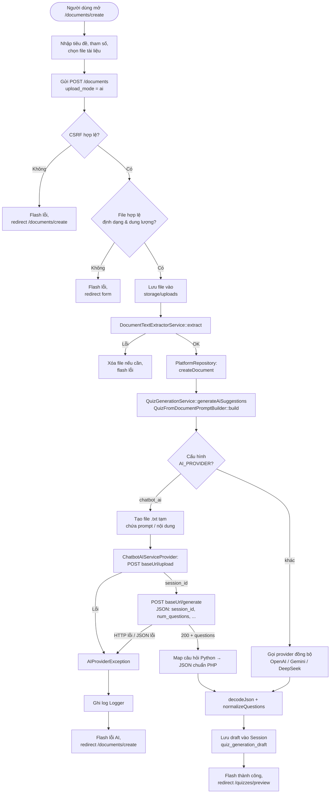

### 3.1. Biểu đồ BPMN (Mermaid) — cùng luồng, 3 swimlane

Biểu đồ dưới đây tái hiện **cùng nghiệp vụ** như mục 3, trình bày theo kiểu **pool BPMN** với ba **lane**: *Người dùng*, *Hệ thống PHP*, *Module AI* (microservice CHATBOT-AI). Mermaid không hỗ trợ đầy đủ ký hiệu BPMN 2.0 (event/gateway chuẩn), nên các lane được mô hình bằng `subgraph`; các bước tương tác mạng giữa PHP và AI được nối xuyên >lane theo thứ tự thực thi (`ChatbotAIServiceProvider` gọi `cURL` đồng bộ tới `/upload` rồi `/generate`).

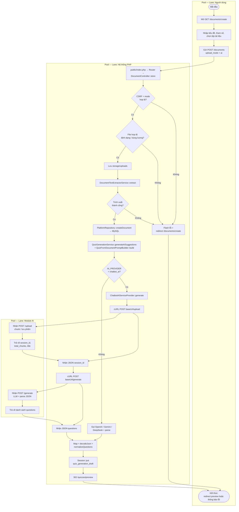

**Chú thích BPMN (ánh xạ nhanh):** sự kiện bắt đầu/kết thúc dùng hình tròn kép `([...])`; cổng quyết định dùng hình thoi `{...}`; hoạt động dùng hình chữ nhật. Luồng **tin nhắn** giữa lane PHP và lane AI tương ứng hai lần gọi HTTP đồng bộ trong `ChatbotAIServiceProvider`.

---

## 3.2. U5 và U7 — Activity & Sequence chi tiết (trích xuất văn bản + CHATBOT-AI FastAPI)

**Giả định minh họa:** `AI_PROVIDER=chatbot_ai` trong `.env`, `bootstrap.php` inject `ChatbotAIServiceProvider` (`AI_SERVICE_URL`, mặc định `http://localhost:8000`). Microservice **CHATBOT-AI** nhận `POST /upload` (multipart) và `POST /generate` (JSON), pipeline phía Python: chunking → LLM → parse JSON (theo comment trong code PHP).

**Khác biệt U5 vs U7:** **U5** tải tệp mới, **`DocumentTextExtractorService::extract`** trên đĩa (`storage/uploads`), rồi **`createDocument`** lưu `extracted_content` vào MySQL. **U7** không đụng tệp: lấy **`document_content`** đã có trong **session draft** (`quiz_generation_draft`), sau đó cùng chuỗi **`QuizGenerationService::generateAiSuggestions`** → provider (khi `chatbot_ai`: vẫn gói prompt thành file `.txt` tạm → `/upload` → `/generate`).

**Nhánh provider khác:** Nếu OpenAI/Gemini/DeepSeek, bước FastAPI được thay bằng HTTP tới API tương ứng trong PHP (`OpenAIProvider`, `GeminiAIProvider`, …); **không** qua `/upload`/`/generate` của CHATBOT-AI.

### 3.2.1. U5 — Biểu đồ hoạt động (chi tiết)

```mermaid
flowchart TD
    Start([Người dùng: GET /documents/create]) --> Fill[Điền tiêu đề, question_count,\ndifficulty, language, chọn file]
    Fill --> Post[POST /documents\nupload_mode = ai]

    Post --> A1{DocumentController::store\nCSRF hợp lệ?}
    A1 -->|Không| E1[Flash lỗi → /documents/create]
    A1 -->|Có| A2{upload_mode == ai?}
    A2 -->|Không| E1
    A2 -->|Có| A3{Tiêu đề không rỗng?}
    A3 -->|Không| E1
    A3 -->|Có| A4[Chuẩn hóa question_count 1–50,\ndifficulty easy / medium / hard,\nlanguage vi hoặc en]

    A4 --> PD[prepareUploadedDocument]
    PD --> F1{Có document_file\nvà UPLOAD_ERR_OK?}
    F1 -->|Không| E1
    F1 -->|Có| F2{extension ∈\npdf, docx, txt?}
    F2 -->|Không| E1
    F2 -->|Có| F3{0 < size ≤ 15MB?}
    F3 -->|Không| E1
    F3 -->|Có| F4[Đảm bảo thư mục\nstorage/uploads]
    F4 --> F5[move_uploaded_file\n→ đường dẫn tuyệt đối]

    F5 --> EXT[DocumentTextExtractorService::extract\npath + extension]
    subgraph SG_EXT["Chi tiết trích xuất (theo đuôi file)"]
        direction TB
        EXT --> XT{extension}
        XT -->|txt| T1[Đọc file_get_contents\nnormalizeExtractedText]
        XT -->|docx| T2[Ưu tiên PhpWord IOFactory\nfallback ZIP word/document.xml\n→ normalize]
        XT -->|pdf| T3[extractPdf\n→ normalize]
        T1 --> F6[Trả prepared:\ntitle, paths, extracted_content]
        T2 --> F6
        T3 --> F6
    end

    EXT -->|throw RuntimeException\n→ catch trong prepare:\nxóa file, flash, return null| FX[Kết thúc nhánh lỗi\ntại prepareUploadedDocument]
    FX --> EndFail([Kết thúc lỗi])

    F6 --> DBW[PlatformRepository::createDocument\nghi metadata + extracted_content\n→ MySQL]
    DBW --> BL[buildLanguageAwareContent\nchèn LANGUAGE_REQUIREMENT]

    BL --> QGS[QuizGenerationService::generateAiSuggestions]
    QGS --> PREP[prepareDocumentContent\ncắt ngưỡng theo cấu hình]
    PREP --> PB[QuizFromDocumentPromptBuilder::build\nmb_substr theo AI_DOCUMENT_CONTEXT_CHARS\n+ META_QUESTION_COUNT footer]
    PB --> PRV{AIProviderInterface\nimplementation?}

    PRV -->|chatbot_ai\nChatbotAIServiceProvider| CB0[generate(prompt string)]
    CB0 --> CB1{prompt là JSON\nđã có session_id?}
    CB1 -->|Có| CB6[callGenerate(payload)\ntrực tiếp]
    CB1 -->|Không| CB2[parseNumQuestionsFromPrompt /\nparseDifficultyFromPrompt]
    CB2 --> CB3[uploadTextAsFile:\ntempnam .txt + file_put_contents\nnội dung prompt]
    CB3 --> CB4[cURL multipart\nPOST AI_SERVICE_URL/upload]
    CB4 --> AI1[(CHATBOT-AI FastAPI\nPOST /upload)]
    AI1 --> CB5[Nhận session_id,\ntotal_chunks, title]
    CB5 --> CB6
    CB6 --> CB7[cURL JSON\nPOST .../generate\nsession_id, num_questions,\ndifficulty, language, auto_review]
    CB7 --> AI2[(CHATBOT-AI FastAPI\nPOST /generate)]
    AI2 --> CB8[Nhận questions[]\nmapQuestions → AIResult.content\nJSON string cho PHP]
    CB8 --> DEC[QuizGenerationService:\ndecodeJson + normalizeQuestions]

    PRV -->|openai / gemini /\ndeepseek| API[Gọi API LLM\ntrực tiếp từ PHP]
    API --> DEC

    DEC --> DRAFT[Session::put\nquiz_generation_draft]
    DRAFT --> OK[Flash thành công\n302 /quizzes/preview]
    OK --> EndOk([Kết thúc thành công])

    QGS -->|Throwable| LOG[Logger::error\nflash + redirect /documents/create]
    LOG --> EndFail
    E1 --> EndFail
```

### 3.2.2. U5 — Biểu đồ trình tự (chi tiết)

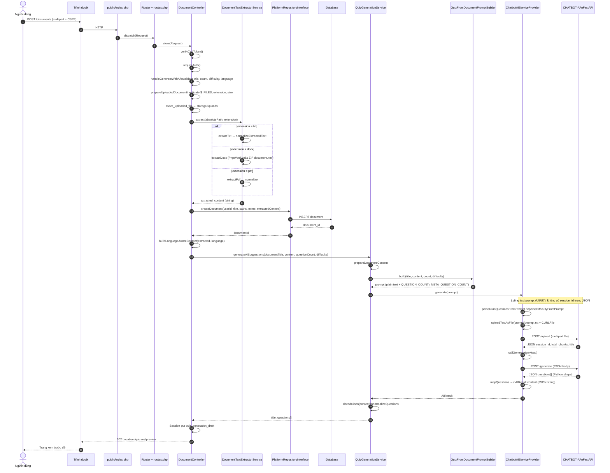

### 3.2.3. U7 — Biểu đồ hoạt động (chi tiết — gợi ý AI trên preview)

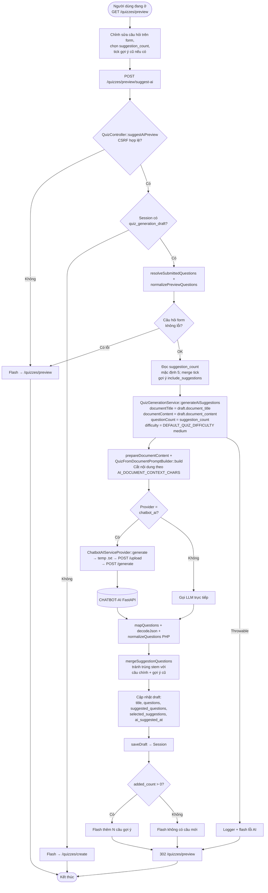

### 3.2.4. U7 — Biểu đồ trình tự (chi tiết)

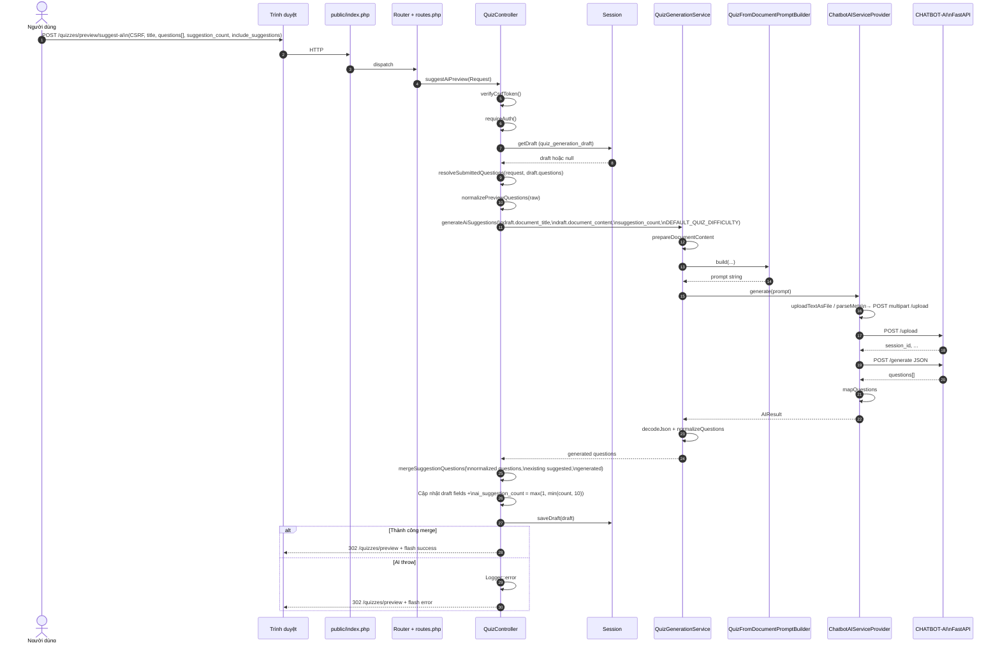

---

## 3.3. Admin (A1–A4) — Biểu đồ hoạt động

Tất cả route `/admin/*` đều qua `requireAuth(['admin'])` trong `AdminController` (nếu không phải admin hoặc chưa đăng nhập: flash, chuyển hướng về `roleHomePath`). Dữ liệu đọc/ghi chủ yếu qua **`PlatformRepositoryInterface`** (MySQL). Phần **trọng tâm** dưới đây là **A2 — Cấu hình hệ thống (AI runtime)** và **A3 — Duyệt câu hỏi / báo cáo**; A1 và A4 tóm tắt ngắn.

> **Ghi chú tích hợp CHATBOT-AI:** Form admin **không** lưu `chatbot_ai`; provider lưu trong DB chỉ `openai` / `gemini` / `deepseek`. Dùng **`AI_PROVIDER=chatbot_ai`** trong `.env` (`bootstrap.php`) nếu cần FastAPI — không nằm trong luồng form A2.

### 3.3.1. A2 — Cấu hình hệ thống (AI runtime)

Luồng **`GET /admin/ai`** (`aiSettings`) hiển thị form; **`POST /admin/ai`** (`saveAiSettings`) lưu provider, model, key (và xóa key theo checkbox), reset `ai_quiz_prompt_template` về rỗng.

```mermaid
flowchart TD
    subgraph GET["GET /admin/ai — hiển thị cấu hình"]
        G0([Admin mở trang AI]) --> G1{requireAuth admin?}
        G1 -->|Không| GX[Kết thúc: redirect login / home]
        G1 -->|Có| G2[Đọc config app\n+ Env OPENAI_MODEL, GEMINI_MODEL, DEEPSEEK_MODEL]
        G2 --> G3[getSetting ai_runtime_provider\nopenai_model, gemini_model,\ndeepseek_model, các api_key]
        G3 --> G4[Tính formProvider:\nưu tiên DB nếu thuộc whitelist\nngược lại fallback config/env]
        G4 --> G5[Tính effectiveProvider\nvà aiModelValue theo\nprovider đang chọn]
        G5 --> G6[Flags openaiKeySet,\ngeminiKeySet, deepseekKeySet]
        G6 --> G7[render admin/ai]
        G7 --> GEND([Hiển thị form])
    end

    subgraph POST["POST /admin/ai — lưu cấu hình"]
        P0([Admin gửi form Lưu]) --> P1{requireAuth admin?}
        P1 -->|Không| PX[Kết thúc]
        P1 -->|Có| P2{CSRF hợp lệ?}
        P2 -->|Không| PE[Flash lỗi → redirect /admin/ai]
        P2 -->|Có| P3[Đọc ai_provider từ form\nchuẩn hóa lowercase]
        P3 --> P4{Provider ∈\nopenai, gemini, deepseek?}
        P4 -->|Không| P5[Ép provider = openai]
        P4 -->|Có| P6[Giữ provider]
        P5 --> P7
        P6 --> P7[setSetting ai_runtime_provider]
        P7 --> P8{ai_model\nkhông rỗng?}
        P8 -->|Không| PE
        P8 -->|Có| P9[setSetting model tương ứng:\nopenai_model / gemini_model /\ndeepseek_model]
        P9 --> P10[Xử lý clear_openai_key,\nclear_gemini_key,\nclear_deepseek_key = 1\n→ setSetting key rỗng]
        P10 --> P11{api_key input\ncó nội dung?}
        P11 -->|Có| P12[setSetting api_key\nđúng provider]
        P11 -->|Không| P13[Bỏ qua cập nhật key]
        P12 --> P14
        P13 --> P14[setSetting ai_quiz_prompt_template\n= chuỗi rỗng]
        P14 --> P15[Đọc lại key DB + env\n→ keyReady theo provider]
        P15 --> P16[Flash success\nchi tiết model + key]
        P16 --> P17[302 /admin/ai]
        P17 --> PEND([Kết thúc])
        PE --> PEND
    end
```

### 3.3.2. A3 — Duyệt câu hỏi & xử lý báo cáo (trọng tâm)

**Danh sách câu hỏi:** `GET /admin/questions` — lọc theo `quiz_id`, `source` (`ai` / `extract`). **Báo cáo câu sai:** `GET /admin/reports` + **`POST /admin/reports/{id}/status`**. Các thao tác **tạo / sửa / xóa / đổi đáp án đúng** câu hỏi dùng route **`/questions/...`** và **`QuestionController`** (cũng `requireAuth(['admin'])`) — từ UI admin thường đi từ trang danh sách.

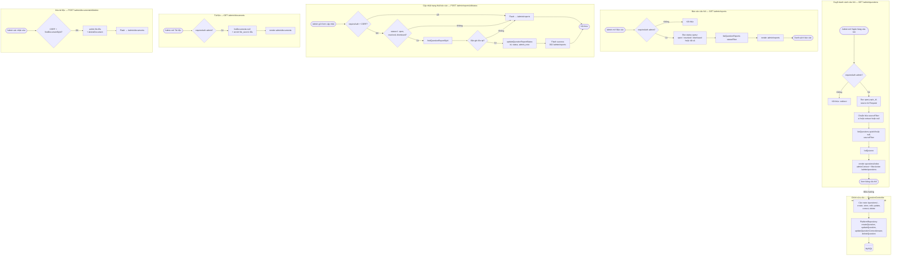

### 3.3.3. A1 — Thống kê dashboard

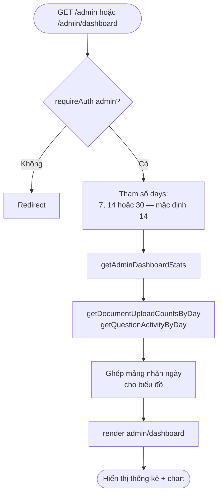

### 3.3.4. A4 — Thành viên (vai trò & khóa tài khoản)

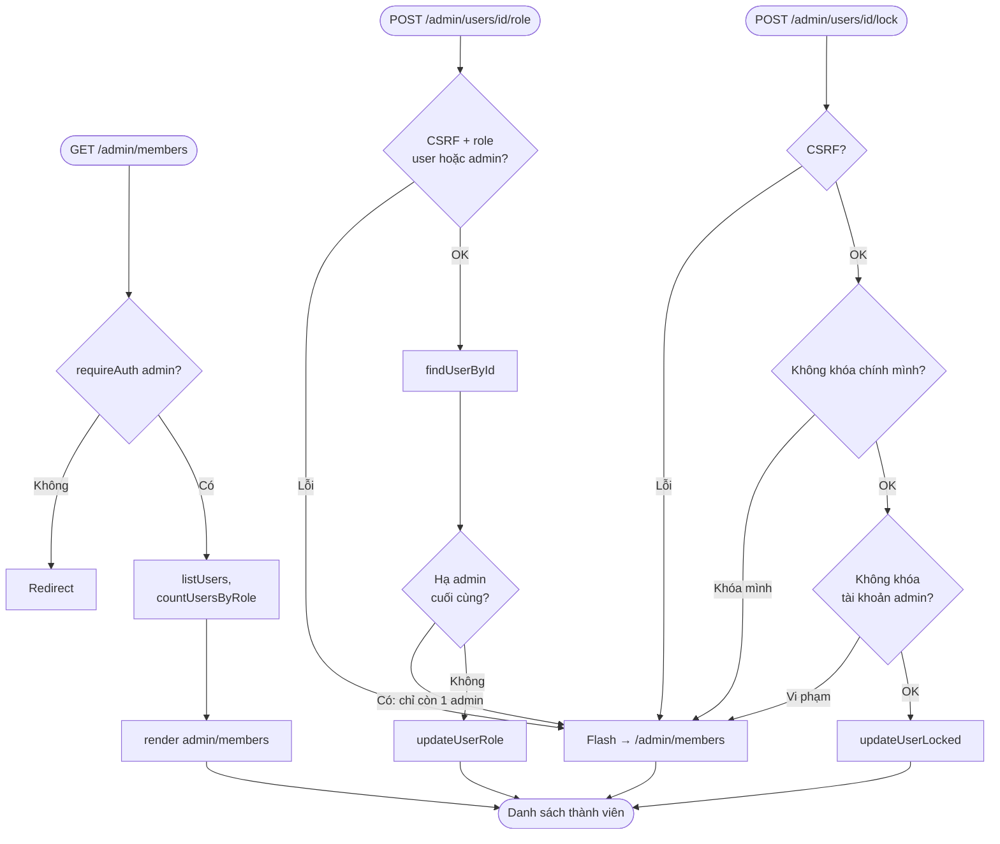

---

## 4. Biểu đồ trình tự — UI → routes.php → Controller → CHATBOT-AI → CSDL

Điểm vào HTTP là `public/index.php` (khởi tạo `Request`, `Router::dispatch`); các tuyến được khai báo trong `routes.php`. Dưới đây là trình tự điển hình cho **POST /documents** với provider **chatbot_ai**.

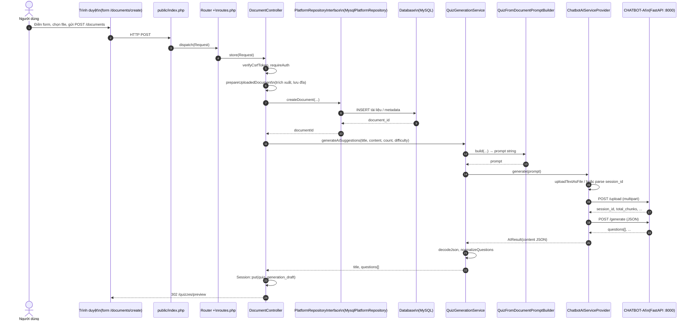

---

## 5. Biểu đồ trình tự — chức năng cốt lõi người dùng (U2, U4, U6, U8)

Các sơ đồ dưới đây thể hiện luồng **Giao diện (trình duyệt)** → **`public/index.php` + `Router` / `routes.php`** → **Controller** → **Repository** (`PlatformRepositoryInterface` / `MysqlPlatformRepository`) → **Database**. Khi cần thiết có thêm **Service** (Auth, QuizGeneration, SubmissionEvaluation, Session) để khớp mã thực tế.

### 5.1. U2 — Đăng ký và đăng nhập

`AuthController` xử lý HTTP; `AuthService` gọi repository để đọc/ghi người dùng và ghi `Session` (`auth_user_id`).

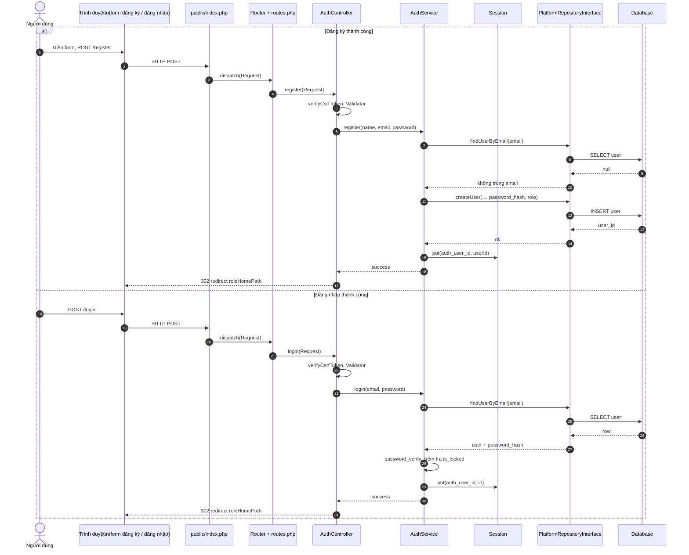

**Ngoại lệ (rút gọn):** CSRF / validator thất bại → flash, quay form; email đã tồn tại khi đăng ký; sai mật khẩu / user null khi đăng nhập; tài khoản khóa → `AuthService` trả `success: false`, không ghi session.

### 5.2. U4 — Quản lý tài liệu (ví dụ: danh sách tài liệu)

Luồng đọc **`GET /documents`**: `DocumentController::index` lấy danh sách qua repository (admin xem tất cả, user chỉ tài liệu của mình).

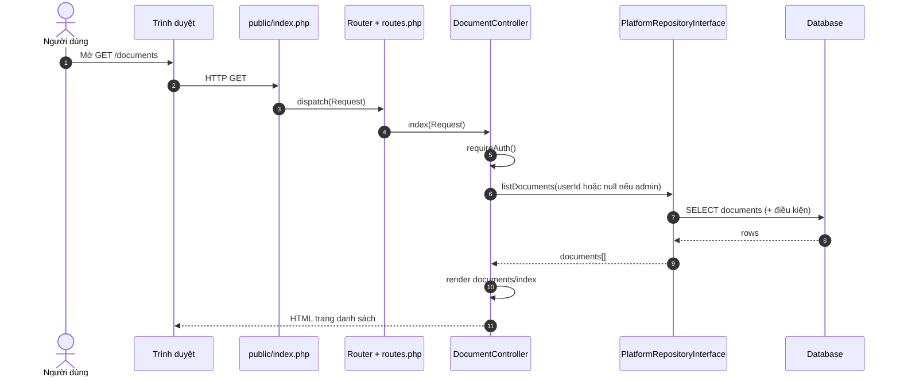

**Biến thể có repository:** `GET /documents/{id}` → `findDocumentById`; `POST /documents/{id}/delete` → `findDocumentById` → xóa file đĩa → `deleteDocument` → DB.

### 5.3. U6 — Tạo đề từ nội dung dán thủ công (parse + lưu đề)

Giai đoạn **dán nội dung** (`POST /quizzes`) chỉ dùng `QuizGenerationService` và **Session** (draft), chưa ghi DB. Giai đoạn **lưu** (`POST /quizzes/preview/save`) mới gọi **`createQuiz`** trên repository (đúng yêu cầu thể hiện tới Repository).

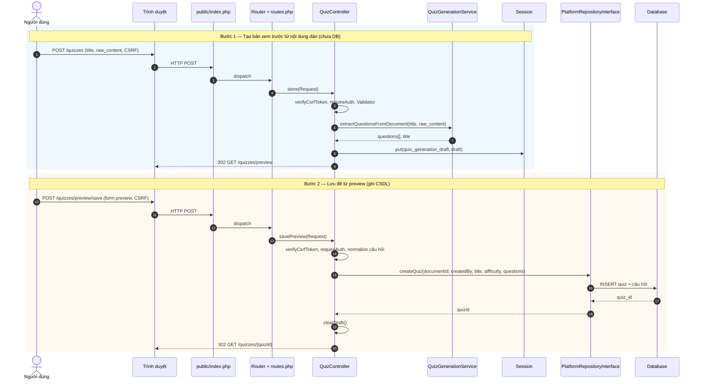

### 5.4. U8 — Làm bài và nộp bài

`take` đọc đề và câu hỏi từ repository; `submit` dùng `SubmissionEvaluationService` chấm điểm rồi `createSubmission`.

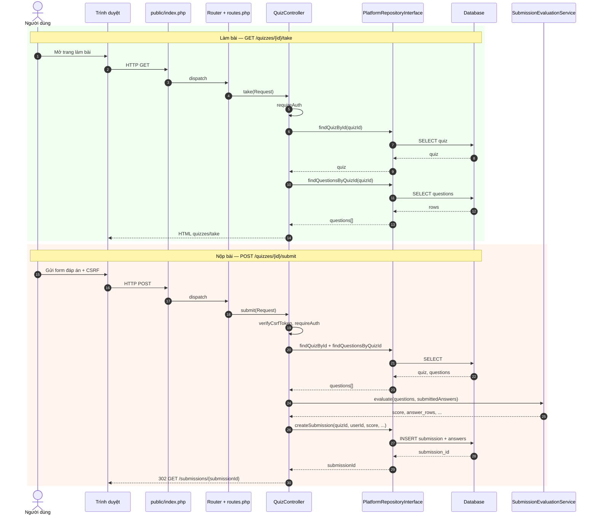

---

## 6. Bảng tham chiếu nhanh (theo mã nguồn)

| Thành phần | Vai trò |
| --- | --- |
| `routes.php` | Đăng ký toàn bộ `GET`/`POST` tới `[Controller::class, 'method']` |
| `App\Core\Router` | Khớp URI + method, khởi tạo controller, gọi action |
| `bootstrap.php` | DI container: `Database`, repository, `AIProviderInterface` (match theo provider), `QuizGenerationService` |
| `ChatbotAIServiceProvider` | Proxy: `/health`, `/upload`, `/generate`; map trường câu hỏi từ Python sang JSON mà `QuizGenerationService` parse được |
| `QuizGenerationService` | Build prompt, gọi AI, chuẩn hóa câu hỏi, ngoại lệ `AIProviderException` / `ValidationException` |

---

*Tài liệu được sinh từ phân tích mã nguồn trong workspace; khi thay đổi route hoặc provider, cần cập nhật lại các sơ đồ cho khớp.*
