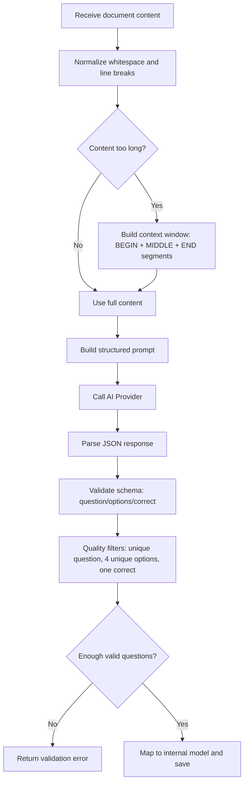

# AI Module - Document to MCQ

## 1) Purpose
Generate multiple-choice questions from uploaded document content.

## 2) Input
- `document_content` (string): extracted text from PDF/DOCX/TXT
- `question_count` (int): expected number of questions (1-30)
- `difficulty` (string): `easy | medium | hard`
- `document_title` (string): title for context

## 3) Output
Strict JSON object:

```json
{
  "title": "...",
  "questions": [
    {
      "question": "...",
      "options": ["A text", "B text", "C text", "D text"],
      "correct": "A"
    }
  ]
}
```

Internal mapping before save:
- `question` -> `question_content`
- `options[0..3]` -> `answers.A..D`
- `correct` -> `correct_answer`

## 4) Prompt Design
System intent:
- Generate MCQ items from source text only.
- Return strict JSON only.

Prompt template:

```text
AI_MODULE: document_to_mcq
DOC_TITLE: {document_title}
DIFFICULTY: {difficulty}
QUESTION_COUNT: {question_count}
OUTPUT_SCHEMA_VERSION: 1.0

TASK:
- Generate exactly {question_count} multiple-choice questions from the source content.
- Keep each question factual and traceable to the source content.
- Each question must have exactly 4 options and exactly 1 correct answer.
- Do not output duplicate questions.
- Avoid "all of the above" and "none of the above".

OUTPUT RULE:
- Return strict JSON only (no markdown, no explanations).
- Use schema: title, questions[].question, questions[].options[4], questions[].correct

SOURCE_DOCUMENT_CONTENT:
"""
{document_content_window}
"""
```

## 5) Processing Flow



## 6) Validation Rules
- `questions` must be an array.
- Each item must include non-empty `question`.
- `options` must have exactly 4 non-empty strings.
- `correct` must be one of `A|B|C|D`.
- Fallback: if `correct` is missing, system extracts answer letter from the option containing `(correct)` (case-insensitive).
- Remove duplicate questions by normalized fingerprint.
- Reject items where options are duplicated.

## 7) Example Output

```json
{
  "title": "Database Fundamentals Quiz",
  "questions": [
    {
      "question": "What is the main purpose of database normalization?",
      "options": [
        "Reduce data redundancy",
        "Increase table size",
        "Remove primary keys",
        "Disable indexing"
      ],
      "correct": "A"
    }
  ]
}
```
